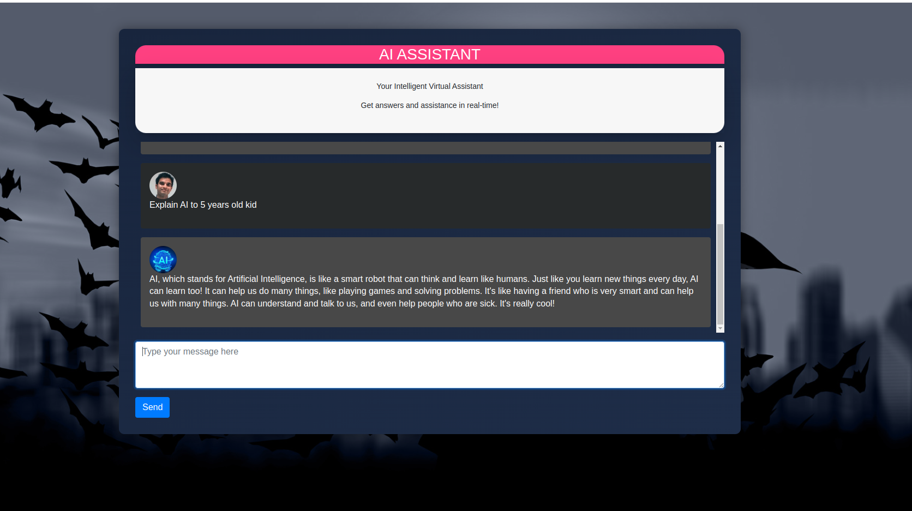

# AI VIRTUAL ASSISTANT
This is your AI Virtual Assistant. The application is developed by the OpenAI's Chat GPT API "gpt-3.5-turbo" and Flasks.
# Step By Step Instruction
1. **Install Python on your computer:**
   * Visit the official Python website (https://www.python.org) and download the latest version of Python suitable for your operating system.
   * Follow the installation instructions provided by Python to complete the installation.
2. **Navigate to the directory where you have cloned or downloaded the repository:**
   * Open a terminal or command prompt on your computer.
   * Use the cd command to navigate to the directory where you have cloned or downloaded the repository.
     For example, if the repository is located in the "AI Virtual Assistant" folder on your desktop, you would use the command: cd Desktop/AI Virtual Assistant.
3. **Install the required Python packages:**
   * In the terminal or command prompt, run the following command: pip install -r requirements.txt.
   * This command will install all the necessary Python packages listed in the "requirements.txt" file.
4. **Obtain an API key from OpenAI:**
   * Visit the OpenAI website (https://www.openai.com) and sign up for their API program.
   * Follow the instructions provided by OpenAI to obtain an API key.
   * Copy the API key as you will need it in the next step.
5. **Add your OpenAI API key to the app.py file:**
   * Open the app.py file in a text editor.
   * Locate the line that says openai.api_key = 'YOUR_API_KEY'.
   * Replace 'YOUR_API_KEY' with the API key you obtained from OpenAI.
   * Save the app.py file.
6. **Start the application by running the Flask server:**
   * In the terminal or command prompt, run the following command: python app.py.
   * This command will start the Flask server and the application will be up and running.
7. **Interact with the AI Virtual Assistant:**
   * Open a web browser and visit http://localhost:5000 (or http://127.0.0.1:5000).
   * You will see a text input field where you can enter your prompt.Type in a prompt and press Enter or click on the "Send" button.
   * The application will use the OpenAI API to generate a response based on your prompt.
   * The generated response will be displayed on the webpage.

