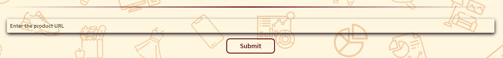
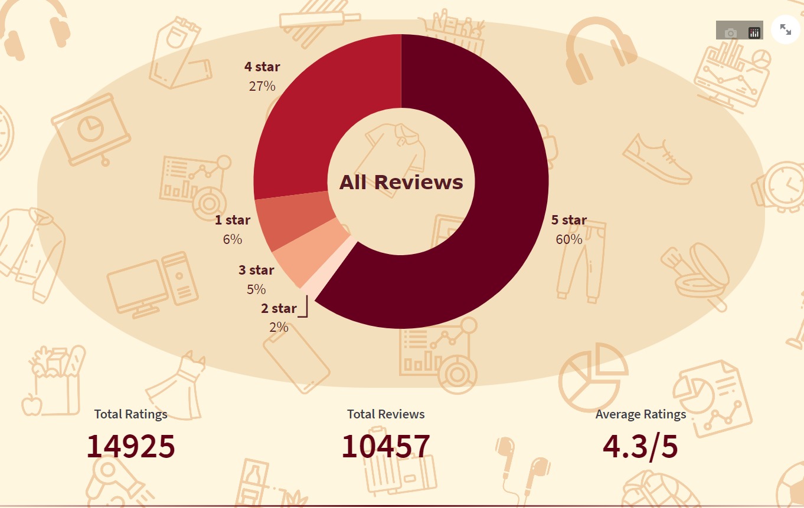
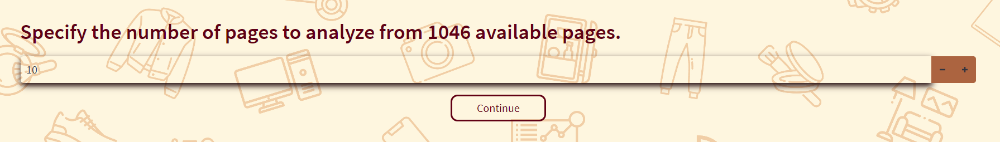
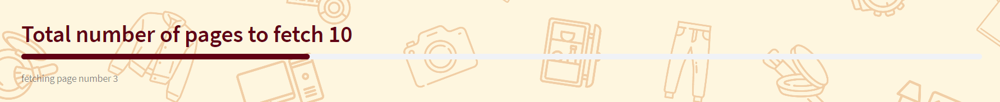

# Amazon Review Analyst

## Summary

#### This is web application built and hosted using Streamlit, that provides users with product analytics by simply inputting the URL of product they are interested in purchasing. This includes information such as the number and type of ratings, as well as the number of reviews. Additionally, a backend ML model performs sentiment analysis on the reviews, providing users with a suggestion on whether or not to purchase the product based on the number of positive, negative, and mixed reviews.

The default styling of streamlit has been modified by injecting custom `HTML` and `CSS Styling`.

## How to use it

##### Step-1: You need to get the `URL` of the product inorder to do an analysis before buying it. You can simply get the URL of the product by openiing the product in browser and copying the URL from URL bar.
##### Step-2: Clone the repo. Install the `requirements.txt` file. And run the command `streamlit run app.py` 
##### Step-3: Paste the product URL into the `Enter the product URL` field and press `Enter` or click on `Submit` button. 

##### Step-4: If your product URL is valid and the product is available on `Amazon India` then the product image and name will be displayed.

##### And after that if there are ratings and reviews available for the product then the number of `Star ratings` will be displayed in the form of a `Doughnut Pie Chart` and below that average rating of the product and total number of ratings and reviews will be displayed. 

##### Step-5: In order to initiate the `Sentiment Analysis` process, you are required to make a selection between analyzing all available reviews or solely those from the most recent `N pages`. It is important to note that selecting the option to analyze all reviews may result in a lengthier data retrieval process. Following your selection, kindly proceed by clicking the designated `Proceed` button.

##### Step-6: Upon choosing the `First` option, the system shall initiate a process to fetch the reviews from all accessible pages. However, upon selecting the `Second` option, the user will be prompted to indicate the desired latest `Number of Pages` for review acquisition and subsequent sentiment analysis. If the total count of pages falls below or equals to five, the system shall automatically obtain all reviews available for sentiment analysis.

#####  Input the desired `Number of Pages` from which reviews are to be retrieved, and subsequently, select the `Continue` button to proceed.

##### The system will start fetching product reviews and provide visual feedback on the progress through a `progress bar`.

##### Upon retrieving all the reviews, an automated sentiment analysis will be executed, subsequently presenting the quantity of reviews categorized as `Positive`, `Negative`, and `Mixed`.

##### After evaluating the quantity of reviews reflecting various sentiments, a recommendation shall be generated as to whether the purchase of said item should be deemed advisable or not.

##### You can find `Positive`, `Negative`, and `Mixed` reviews separated into their respective `dropdowns` below.

##### To visit my `Instagram`, `Github`, and `LinkedIn` profiles, kindly navigate to the left-hand bottom section of the web application and click on the corresponding icons designated for each platform.

## Disclaimer

##### This project has been created purely for educational and learning purposes. It is not intended for any commercial or professional use. The data collected through this project is solely for personal use and should not be reproduced or distributed in any form without permission.

##### We do not assume any responsibility for the accuracy, reliability, or completeness of the information obtained through this project. Furthermore, we are not responsible for any legal consequences that may arise from the use of this project.

##### We urge you to use this project responsibly and within the bounds of the law.