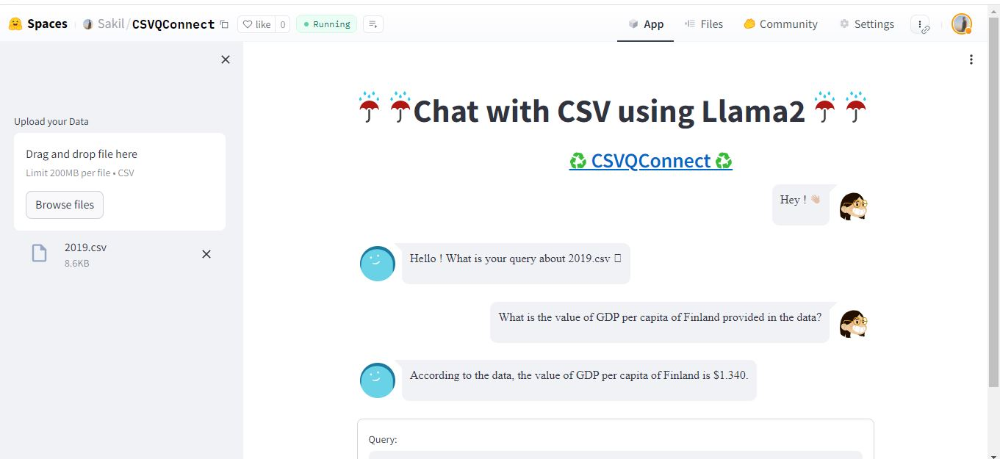

### CSVQConnect Introduction

In the age of data-driven decision-making, extracting insights from vast troves of information has become increasingly crucial. However, navigating through complex datasets can be a daunting task, often requiring specialized skills and tools. CSVQConnect, application powered by Llama2, LangChain, and vectordb Faiss DB, aims to bridge this gap by enabling seamless conversational interactions with CSV data.

With CSVQConnect, users can upload their CSV files and engage in natural language queries to retrieve specific information or uncover hidden patterns. The application's intelligent language processing capabilities transform raw data into meaningful insights, empowering users to make informed decisions without the need for technical expertise.

### Line By Line Explanation
```python
import streamlit as st 
from streamlit_chat import message
import tempfile
from langchain.document_loaders.csv_loader import CSVLoader
from langchain.embeddings import HuggingFaceEmbeddings
from langchain.vectorstores import FAISS
from langchain.llms import CTransformers
from langchain.chains import ConversationalRetrievalChain

```
**Imports:** Importing necessary libraries and modules, including Streamlit for building web applications, streamlit_chat for handling chat messages, and various modules from the LangChain library for loading CSV data, embeddings, vector stores, language models, and conversational retrieval chains.

```python
DB_FAISS_PATH = 'vectorstore/db_faiss'
background_image_path = 'image1.jpg'

```
**Global Variables:** Setting global variables such as the path for the FAISS vector store (DB_FAISS_PATH) and the path for the background image (background_image_path)

```python
#Loading the model
def load_llm():
    # Load the locally downloaded model here
    llm = CTransformers(model='TheBloke/Llama-2-7B-Chat-GGML', model_file='llama-2-7b-chat.ggmlv3.q8_0.bin', max_new_tokens=512, temperature=0.1, gpu_layers=50)
    return llm

```
**Loading the Model Function:** Defining a function load_llm to load the LLM (Language Model). The [CTransformers](https://github.com/marella/ctransformers "CTransformers") is python  bindings for the Transformer models implemented in C/C++. C Transformers library can be used  within[ LangChain](https://python.langchain.com/docs/integrations/providers/ctransformers " LangChain").There exists a CTransformers LLM wrapper, which you can access with:
```python
from langchain.llms import CTransformers
```
It can be used with models hosted on the Hugging Face Hub:
```python
llm = CTransformers(model='TheBloke/Llama-2-7B-Chat-GGML')
```

If a model repo has multiple model files (.bin files), specify a model file using:
```python
llm = CTransformers(model='TheBloke/Llama-2-7B-Chat-GGML', model_file='llama-2-7b-chat.ggmlv3.q8_0.bin)'
```
```python
st.title("☔ ☔Chat with CSV using Llama2 ☔ ☔")
st.markdown("<h3 style='text-align: center; color: white;'>Built by <a href=https://github.com/Sakil786/CSVQConnect/tree/main>♻️ CSVQConnect ♻️ </a></h3>", unsafe_allow_html=True)

```
**Streamlit Setup:** Setting up the Streamlit application with a title and a markdown description with a hyperlink.

```python
# Your background image URL goes here
background_image_path = 'image1.jpg'

```
**Background Image Setup: ** Path of the background_image_path.
```python
uploaded_file = st.sidebar.file_uploader("Upload your Data", type="csv")

if uploaded_file:
    # use tempfile because CSVLoader only accepts a file_path
    with tempfile.NamedTemporaryFile(delete=False) as tmp_file:
        tmp_file.write(uploaded_file.getvalue())
        tmp_file_path = tmp_file.name

```

**File Uploader:** Using Streamlit's sidebar to provide a file uploader for users to upload a CSV file. If a file is uploaded, it is written to a temporary file using tempfile.NamedTemporaryFile, and the path is stored in tmp_file_path.

        loader = CSVLoader(file_path=tmp_file_path, encoding="utf-8", csv_args={'delimiter': ','})
        data = loader.load()
        embeddings = HuggingFaceEmbeddings(model_name='sentence-transformers/all-MiniLM-L6-v2')
    
        db = FAISS.from_documents(data, embeddings)
        db.save_local(DB_FAISS_PATH)
        llm = load_llm()
        chain = ConversationalRetrievalChain.from_llm(llm=llm, retriever=db.as_retriever())
    

**Data Processing: **Loading the uploaded CSV data using the LangChain library's CSVLoader. The data is then used to create embeddings with the Hugging Face model specified. A FAISS vector store is created from the embeddings, saved locally, and a Conversational Retrieval Chain is set up using the loaded LLM.
```python
    def conversational_chat(query):
        result = chain({"question": query, "chat_history": st.session_state['history']})
        st.session_state['history'].append((query, result["answer"]))
        return result["answer"]

```

**Conversational Chat Function: ** Defining a function conversational_chat that takes a user query, utilizes the Conversational Retrieval Chain to generate a response, and updates the chat history stored in st.session_state.

```python
    if 'history' not in st.session_state:
        st.session_state['history'] = []

    if 'generated' not in st.session_state:
        st.session_state['generated'] = ["Hello! What is your query about " + uploaded_file.name + " 🤗"]

    if 'past' not in st.session_state:
        st.session_state['past'] = ["Hey! 👋"]

```

**Session State Initialization:** Checking if session state variables (history, generated, and past) exist and initializing them if not. These variables are used to keep track of the chat history.

        #container for the chat history
        response_container = st.container()
        #container for the user's text input
        container = st.container()
    

**Container Setup:** Creating Streamlit containers to organize the layout. `response

```python
with container:
    with st.form(key='my_form', clear_on_submit=True):
        user_input = st.text_input("Query:", placeholder="Search answer from your CSV data here (:", key='input')
        submit_button = st.form_submit_button(label='Send')

    if submit_button and user_input:
        output = conversational_chat(user_input)
        st.session_state['past'].append(user_input)
        st.session_state['generated'].append(output)

```

**User Input Form:**Creating a form using st.form to take user input for a query.Displaying a text input field and a submit button.If the submit button is clicked and there's user input, it calls the conversational_chat function and updates the chat history.

```python
if st.session_state['generated']:
    with response_container:
        for i in range(len(st.session_state['generated'])):
            message(st.session_state["past"][i], is_user=True, key=str(i) + '_user', avatar_style="big-smile")
            message(st.session_state["generated"][i], key=str(i), avatar_style="thumbs")

```
**Displaying Chat History:**If there are generated responses, it uses response_container to display the chat history. Each user input and generated response is displayed using the message function from streamlit_chat.

###[HuggingfaceLink](https://huggingface.co/spaces/Sakil/CSVQConnect "HuggingfaceLink")


