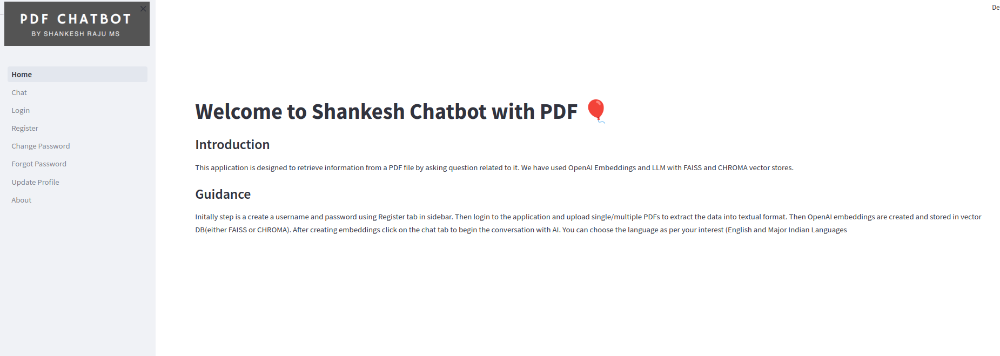
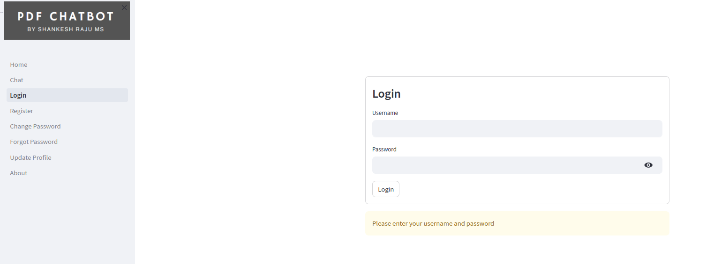
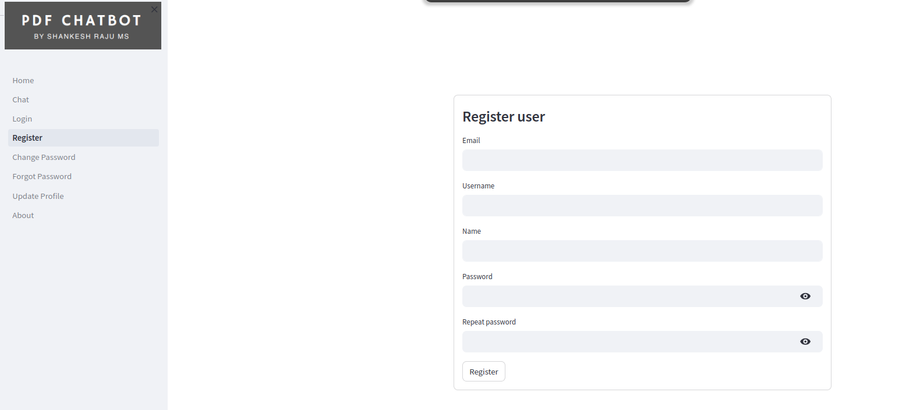
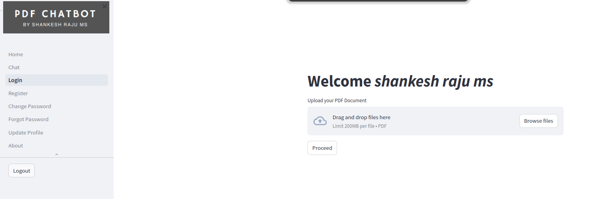
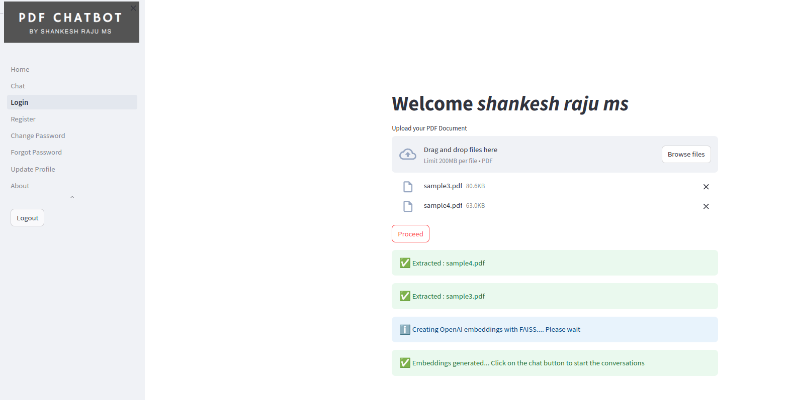
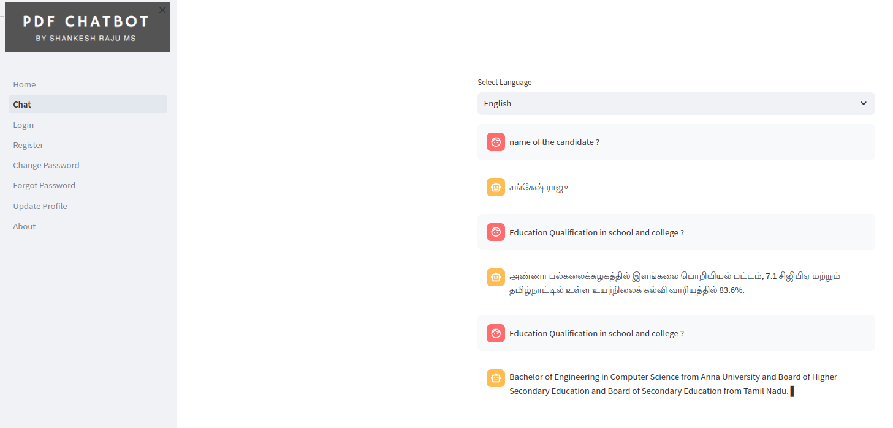

# Mulitple PDFs Chat using LangChain 
### OpenAI - (Embeddings and LLM)
### Vector DB - (FAISS)
### Supported Languages - (English, Tamil, Hindi, Marathi, Malayalam, Telugu, Kannada, Assamese, Bengali, Gujarait, Konkani, Oriya, Punjab, Sanskrit, Urdu, Chinese(Simplifies), French, Korean, Japanese, Portuguese, Italian, Russian)

### Setup
```
pip install langchain langchain-community openai faiss-cpu streamlit streamlit_authenticator PyYAML st_pages deep_translator pathlib configparser PyPDF2 pickle4 langchain_openai python-dotenv streamlit_extras chromadb
```
#### Incase of having GPU 

```
pip install langchain openai faiss-gpu streamlit streamlit_authenticator PyYAML st_pages deep_translator pathlib configparser PyPDF2 pickle4 langchain_openai python-dotenv streamlit_extras chromadb
```

1. Create OpenAI API key from https://platform.openai.com/
2. Create .env file in parent folder and specify the API key as OPENAI_API_KEY = 
"api_key"
3. You can change the vector database to use in config.ini. 

```MODEL_NAME = CHROMA #for chroma vector DB..``` 

```MODEL_NAME = FAISS  #for faiss vector DB```

4. Run ```streamlit run home.html```
5. Create account form Register module
6. Login using the credential, incase of forgetten password use respective module to recovery account and change the password
7. After login, upload one or more PDF files 
8. After extracting text from PDF, embeddings will be generated and stored as vector index
9. After embedding generation, click on the chat menu from sidebar to access the chat module
10. Choose the language to chat with AI (incase of indian languages input can be of either respective indian language or english)

### Screenshots








### Contact
Shankesh Raju MS
shankeshraju@gmail.com	
http://linkedin.com/in/shankeshrajums
