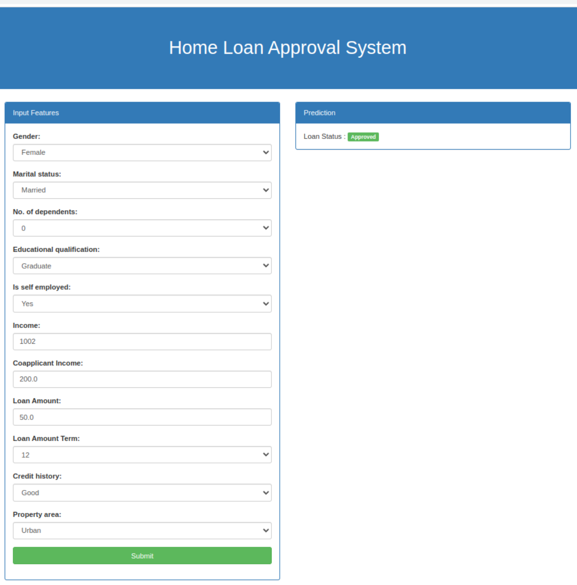

# <div align='center'>Home Loan Approval Prediction System 🚀</div>

<div style="text-align: justify;">
Home Loan Approval Prediction System using machine learning algorithm to analyze data and predict the likelihood of an applicant being approved for a home loan. This can be a valuable tool for both lenders and borrowers. It helps lenders by identifying high-risk applicants early on. It's automated predictions can speed up the loan approval process, leading to a better customer experience. On the other hand, it helps borrowers to understand their strengths and weaknesses as applicant, which can help tailor their application to increase their chances of approval.</div>

## Examples

&nbsp;&nbsp;


## Workflows

1. Update config.yaml
2. Update secrets.yaml [Optional]
3. Update params.yaml
4. Update the entity
5. Update the configuration manager in src config
6. Update the components
7. Update the pipeline


## Dataset

* Here, I have used [this](https://drive.google.com/file/d/1_2PM1emVVVMgnzbjdoUDp-0dlJVaupjf/view?usp=sharing) home loan dataset. You can use your own dataset. Just upload the dataset on your Google Drive and place the URL of the dataset in `config/config.yaml/data_ingestion/source_URL`. Your Google Drive dataset must have all-view access.


## <div style="padding-top: 20px" align="center"> Steps to run </div>

<div style="padding-bottom:10px"><b>STEP 00 :</b> Clone the repository</div>

```bash
https://github.com/utpal108/Home-Loan-Approval-Prediction
```
<div style="padding-top:10px"><b>STEP 01 :</b> Create a virtial environment after opening the repository</div>

Using Anaconda Virtual Environments

```bash
conda create -n venv python=3.10 -y
conda activate venv
```
Or for Linux operating system, you can use that

```bash
python3.10 -m venv venv
source venv/bin/activate
```

<div style="padding-top:10px; padding-bottom:10px"><b>STEP 02 :</b> Install the requirements</div>

```bash
pip install -r requirements.txt
```

Finally, run the following command to run your application:
```bash
python app.py
```

<div style="padding-top:10px"><b>STEP 03 :</b> Run the application</div>

Now,open up your local host with a port like that on your web browser.
```bash
http://localhost:8080
```
<div style="padding-top:10px"><b>STEP 04 :</b> Train the model</div>

Before predicting, you have to train your model with your own dataset.
```bash
http://localhost:8080/train
```
After completing the training, you can now predict the home loan approval status with your input features.


## <div style="padding-top: 20px" align="center"> AWS CICD Deployment With Github Actions </div>


**STEP 00 :** Login to AWS console.

**STEP 01 :** Create IAM user for deployment

	#with specific access

	1. EC2 access : It is virtual machine

	2. ECR: Elastic Container registry to save your docker image in aws


	#Description: About the deployment

	1. Build docker image of the source code

	2. Push your docker image to ECR

	3. Launch Your EC2 

	4. Pull Your image from ECR in EC2

	5. Lauch your docker image in EC2

	#Policy:

	1. AmazonEC2ContainerRegistryFullAccess

	2. AmazonEC2FullAccess

	
**STEP 02 :** Create ECR repo to store/save docker image

    - Save the URI: 681776806933.dkr.ecr.us-east-2.amazonaws.com/home-loan

	
**STEP 03 :** Create EC2 machine (Ubuntu) 

**STEP 04 :** Open EC2 and Install docker in EC2 Machine:
	
	
	#optinal

	sudo apt-get update -y

	sudo apt-get upgrade
	
	#required

	curl -fsSL https://get.docker.com -o get-docker.sh

	sudo sh get-docker.sh

	sudo usermod -aG docker ubuntu

	newgrp docker
	
**STEP 05 :** Configure EC2 as self-hosted runner:
    setting>actions>runner>new self hosted runner> choose os> then run command one by one

**STEP 06 :** Setup github secrets:

    AWS_ACCESS_KEY_ID=

    AWS_SECRET_ACCESS_KEY=

    AWS_REGION = us-east-2

    AWS_ECR_LOGIN_URI = demo>>  681776806933.dkr.ecr.us-east-2.amazonaws.com

    ECR_REPOSITORY_NAME = home-loan