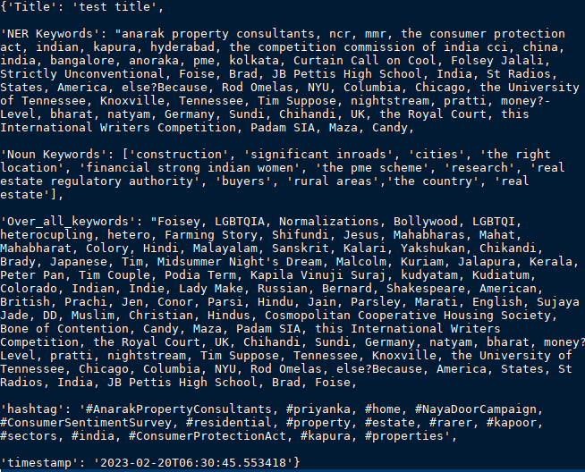
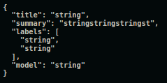
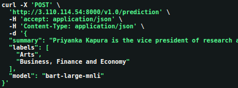
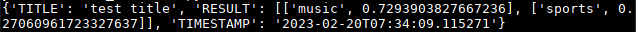
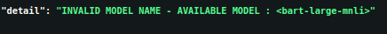

## API Documentation
### Keyword\_Hashtag Endpoint :  `/prediction`
#### Type : `POST`

| Input Parameter | Type | Constraints           |
|-----------------|------|-----------------------|
| Title           | str  | No                    |
| Transcript      | str  | Minimum 30 characters |
| Summary         | str  | Minimum 30 characters |
| Model           | str  | No                    |

#### Curl

	

#### Return
Returns output (NER , Noun, Overall keywords and hashtag) in JSON format with timestamp

#### Error Codes

* **500 - Prediction Module Error :** Occurs when a module fails to execute successfully. Look the list of possible modules

  - PRELIMINARY INITIALIZATION ERROR
  - MODEL INITIALIZATION ERROR
  - SENTENCE TOKENIZING ERROR
  - KEYWORD EXTRACTION ERROR
  - ERROR IN SCORING KEYWORDS
  - TRANSCRIPT CLEANING ERROR
  - ERROR IN DIVIDE\_CHUNKS MODULE
  - ERROR IN CHUNK\_KEYWORDS MODULE
  - ERROR IN OVER\_ALL\_KEYWORDS MODULE
  - ERROR IN TRANSCRIPT\_KEYWORDS MODULE
  - ERROR IN FINAL\_PROCESSING MODULE
  - ERROR IN RETURNING THE OUTPUT

    

    

* **422 - Invalid Input Format :** When the input constraint is not followed

* **401 - Invalid model name**

    

### Topic Endpoint :  `/prediction` 

#### Type : `POST`

| Input Parameter | Type | Constraints           |
|-----------------|------|-----------------------|
| Title           | str  | No                    |
| Summary         | str  | Minimum 30 characters |
| Model           | str  | No                    |

#### Curl

#### Return 

Returns output in JSON format with timestamp

#### Error Codes

* **500 - Prediction Module Error :** Occurs when a module fails to execute successfully. Look the list of possible modules

  - PRELIMINARY INITIALIZATION 
  - MODEL INITIALIZATION
  - TOPIC EMBEDDING
  - SUMMARY EMBEDDING 
  - ERROR IN RETURNING THE OUTPUT
  - RESULT SCORING FAILED
  - COSINE SIMILARITY CALCULATION

     
    
    

* **422 - Invalid Input Format :** When the input constraint is not followed

* **401 - Invalid model name**

  

### Topic_Zeroshot Endpoint :  `/prediction` 

#### Type : `POST`

| Input Parameter   | Type | Constraints           |
|-------------------|------|-----------------------|
| Title             | str  | No                    |
| Summary           | str  | Minimum 30 characters |
| Labels (Optional) | list | Min 2 - Max 20 items  |
| Model             | str  | No                    |

#### Curl

#### Return 

Returns output in JSON format with timestamp

Custom labels

Default labels

#### Error Codes

* **500 - Prediction Module Error :** Occurs when a module fails to execute successfully. Look the list of possible modules

  - PRELIMINARY INITIALIZATION 
  - MODEL INITIALIZATION
  - ERROR IN RETURNING THE OUTPUT
  - ERROR IN ZEROSHOT MODULE

    

* **422 - Invalid Input Format :** When the input constraint is not followed

* **401 - Invalid model name**

  

### Summary Endpoint : `/prediction`

#### Type : `POST`

| Input Parameter | Type | Constraints           |
|-----------------|------|-----------------------|
| Title           | str  | No                    |
| Transcript      | str  | Minimum 30 characters |
| Model           | str  | No                    |

#### Curl 	

#### Return 

Returns output in JSON format with timestamp	

#### Error Codes

* **500 - Prediction Module Error :** when error occurs inside the keyword module

  - ERROR IN EXTRACTING SUMMARY MODULE
  - MODEL INITIALIZATION FAILED
  - PRELIMINARY INITIALIZATION FAILED
  - ERROR IN DISPLAYING THE OUTPUT
  - TRANSCRIPT CLEANING ERROR
  - PREPROCESSING ERROR
  - DIVIDING CHUNKS ERROR

    

    

* **422 - Invalid Input Format :** When the input constraint is not followed

* **401 - Invalid model name**

    

**END**
