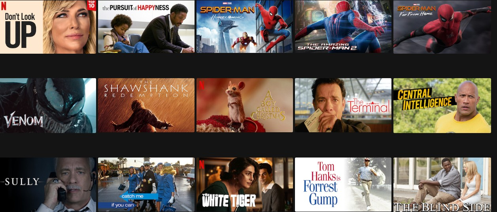
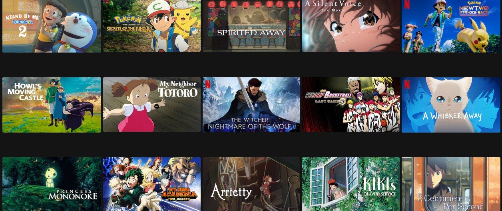

# Netflix-Pricing for Consumer Subscription

# Problem Statement(Interviewer)
You are working as a data scientist at Netflix on their  pricing team.Netflix is a subscription business so Netflix charges a monthly price for the consumer to pay given this price they have decided. How can you determine if the price of the Netflix subscription is actaully a deciding factor for a consumer to buy?

# Clarification Regarding Problem Statement(Interviewee)
The subscription of the Netflix is categorised into three tiers :
1.Basic
2.Standard
3.Premium

* Based on the Interviewer, you can be asked to focuss on all of three tiers or any one of them or any two of them.Here I am focussing on Standard package.

* As Netflix is available across various countries in the world. So you need to ask to the Interviewr whether you need to focus on a particular countries or you need to focus on all the countries.Here I am focussing on India only.

Now we got clarification regarding problem statement i.e. we are dealing with Standard package and covering India region.

# Motivation of asking the question(Interviewee)
As the interviewer wants to understand that price is a determining factor for a consumer to buy subscription.So you need to ask to the interviewer that what is the motivation of asking this question whether the Netflix is going to change the price of the subscription in the near future.

# Objective of the solving this problem(Interviewer)
* To gain more market share as more and more competitors are increasing like Amazon prime,Disney plus.
* To increase the revenue
* More engagements

Sometimes interviewer can give you one objective to provide the solution or sometimes you have been asked to provide the solution of all the objectives or sometimes the interviewer ask you to choose any one of the objective and provide the solution.

Tips: Choose only those objectives in which you are very comfortable to provide the solution.In some cases , the interviewer ask you what might be the objective of solving the problem.If you provide three or four objectives ,the interviewer might ask you to choose any one objective and provide the solution.

Here I am going to choose Revenue.

# Structure and Approach(Interviewee)
* There are many approaches to solve this problem.I would like to follow the following three approaches:
1. **Retrospective analysis on historical data**: Here I will be performing some exploratory data analysis like by taking the price and subscription rate or renewal rate or churn rate.Analysis depends on the historical data.

2. User Service to get direct response of when a user decides to churn the services like out of top 5 questions which one did they pick the most

3. **A/B Experiment**: A/B testing might be trick as we need to provide offerings based on the regions.This testing may be country specific like we can give 2 months free trials subscription to India but we can give 1 month free trial subscription to US.Even offer can be city specific.Suppose we are giving one offer(1 month free trial to metro cities in India like Delhi,Mumbai) and two months free trial for the remaining cities. This help us in understanding whether the price is a sensitive factor or not.

# How to execute the above Solution(Interviewee)
To run above solution, Firstly I require data then after I will create model and finally I will validate the model.

# Data Gathering:
Being interviewee, you need to explain how will you collect the data, what types of data you require, what is the period of data you are expecting.
Data might have different sort of dimensions but here we will be talking about the following main features of the data:
* Price
* Consumption measures and interaction measures like time span,likes ,dislikes shared among the friends.
* time metric like tenure
* demographic or attitudinal like the user is living in certain zip code

# Model Creation:
After getting the data and selecting important features, now we are going to create the model.In this part ,we will give the ranking to each feature and train the model.If the price feature is in first ranking we can say that price is the determing factor for the consumer to buy subscription.Based on the problem statement,your model may be regression,classification,recommendation system ,you can even talk about deep learning technique.

