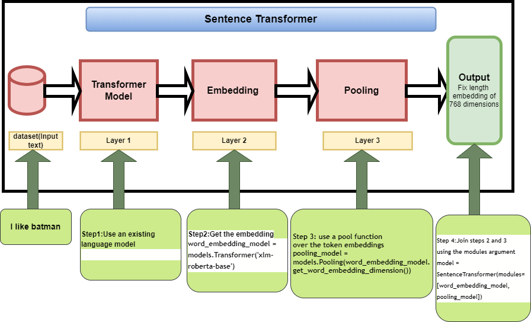
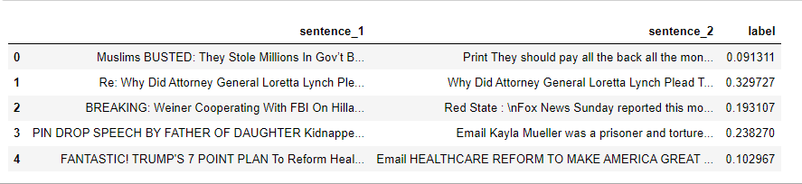
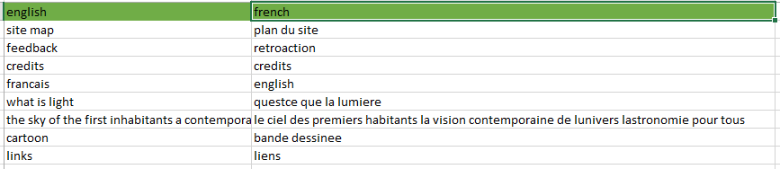
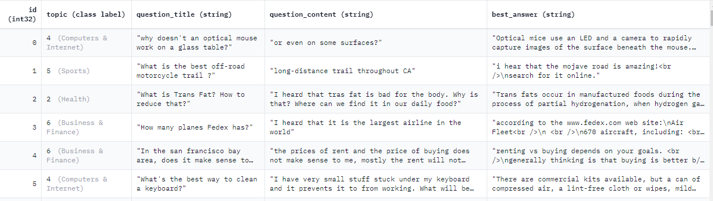
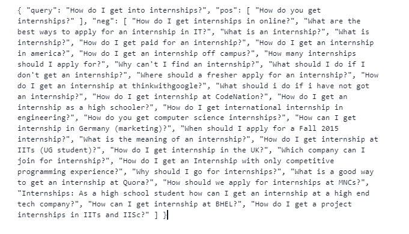

# Unleashing-the-Power-of-Sentence-Transformers-Revolutionising-Semantic-Search-and-Sentence-Similar
Unleashing the Power of Sentence Transformers: Revolutionising Semantic Search and Sentence Similarity

# PART I

# Introduction
As the amount of data available on the internet continues to grow, it becomes increasingly challenging to extract relevant information from the vast amount of unstructured data. Traditional keyword-based search algorithms often fail to produce accurate and relevant results, as they do not take into account the context and meaning of the text. However, recent advancements in Natural Language Processing (NLP) have paved the way for new techniques that can effectively capture the meaning of text, including the use of sentence transformers for semantic search and sentence similarity.

In this article, we'll explore how sentence transformers are revolutionising semantic search and sentence similarity, and how they can be applied to improve the accuracy and relevance of search results.

# What are Sentence Transformers?
Sentence transformers are deep learning models that are specifically designed to convert a sentence into a fixed-length vector representation. These vectors are generated by encoding the semantic meaning of the sentence and can be used for a variety of NLP tasks, including semantic search and sentence similarity.

Traditional NLP models often struggle with understanding the meaning of text, especially when dealing with complex or ambiguous sentences. However, sentence transformers are specifically designed to capture the semantic meaning of a sentence, allowing them to accurately compare and match text based on their meaning, rather than just keywords.

# How do Sentence Transformers Work?

# Layer 1 : 
In this layer , the input text is passed through a pre-trained Transformer model.I have used **xlm-roberta-base** pretrained model .

# Layer 2:
Contextualized word embeddings for all input tokens are calculated.

# Layer 3: 
The embeddings are passed  through a pooling layer to get a single fixed-length embedding for all the text. There are various pooling options, the most basic of which is mean-pooling.We basically average every contextualised word embedding that  **xlm-roberta-base** provides.

# Fine tuning Sentence Transformers model 

When finetuning  the sentence transformer model, it is important to keep the following two considerations in mind :
* Understand your intended task and prepare the data properly.
* Learn the various loss functions and how to apply them to the dataset.
# Various forms of dataset for training Sentence Transformers model

* Scenario 1:
The example includes two sentences with a label indicating how similar they are. The label may be a float or an integer.You can use  **ContrastiveLoss or SoftmaxLoss** if the label format is integer and **CosineSimilarityLoss** if the label format is float.Here is the example for scenario 1.

* Scenario 2:
The example includes a pair of positive (similar) sentences without a label.The examples are pairs of paraphrases, pairs of full texts and their summaries, pairs of duplicate questions, pairs of (query, response), or pairs of (source_language, target_language).You can use **MultipleNegativesRankingLoss** loss function for this scenario.Below is the example for the scenario 2. The source language is english and the target language is French.

.

* Scenario 3
The example includes a sentence with an integer label. By using loss functions, this data format can be easily converted into three sentences (triplets), the first of which serves as a "anchor," the second as a "positive" of the same class as the anchor, and the third as a "negative" of a different class.Please have a look into the following example:

  Sentence: "I love playing football."

  Label: 1

  To convert this into triplets, we need to create two additional sentences - one that is a positive example of the same class as the anchor sentence, and another that   is a negative example of a different class. Let's say we have two additional sentences:

  Positive Sentence: "football is my favorite sport."

  Negative Sentence: "I don't enjoy playing basketball."

  Now we can create the triplets as follows:

  Anchor Sentence: "I love playing football."

  Positive Sentence: "football is my favorite sport."

  Negative Sentence: "I don't enjoy playing basketball."
  
  The Text REtrieval Conference (TREC) Question Classification dataset is an example for this scenario.You can use **Batchhardtripletloss** loss function for this scenario. The sample data is shown below.

.

* Scenario 4: The example included a triplet (anchor, positive, negative) without classes or labels for the sentences.You can use **TripletLoss** loss function for this scenario.Quora Triplets dataset is an example for this scenario.The sample data is shown below:

.

# Limitation of Sentence Transformers:
For semantic search, sentence transformers models perform significantly better than basic transformers models.If your task is classification, the sentence transformer does not perform well.

# An Example for Semantic Textual Similarity:

.

# Article Link : [Medium](https://sakilansari4.medium.com/unleashing-the-power-of-sentence-transformers-revolutionising-semantic-search-and-sentence-29405c13f2b0).
