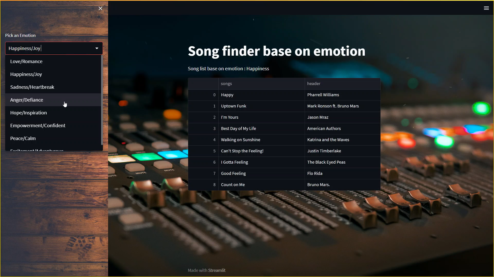

# Song Listing Application based on Emotion

## Introduction

This is a Song Listing Application that uses the LangChain OpenAI API and Streamlit to curate a list of songs based on user-specified emotions. It provides an easy way to discover and listen to songs that match different emotional states.



## Prerequisites

Before you can run this application, make sure you have the following prerequisites installed on your system:

- Python (version 3.7 or higher)
- pip (Python package manager)
- Git (optional, for cloning the repository)

## Installation

1. Clone the GitHub repository:

   ```bash
   git clone https://github.com/PinsaraPerera/SongListingBaseOnEmotion_LangChain-Framework.git
   ```

2. Install the required Python packages using pip:

   ```bash
   pip install -r requirements.txt
   ```

## Configuration

You need to obtain an API key for the LangChain OpenAI API :

```
OPENAI_API_KEY=your_api_key_here
```

Replace `your_api_key_here` with your actual API key.

## Running the Application

To run the application, use the following command:

```bash
streamlit run app.py
```

This will start the application locally. Open a web browser and navigate to the URL provided by Streamlit (usually http://localhost:8501) to access the application.

## Usage

1. Launch the application as described in the previous section.
2. Select an emotion from the dropdown menu.
3. Click on any listed emotion to generate a list of songs that match the selected emotion.
4. Enjoy listening to the recommended songs!

## Contributing

If you'd like to contribute to this project, please fork the repository and create a pull request with your changes. We welcome improvements and bug fixes.

## License

This project is licensed under the [MIT License](LICENSE).

## Contact

If you have any questions or need further assistance, feel free to contact the project maintainer:

- Pawan Perera
- Email: 1pawanpinsara@gmail.com
## Acknowledgments

- This application uses the LangChain OpenAI API to analyze emotions in song lyrics.
- Streamlit was used to create the user interface for this application.

